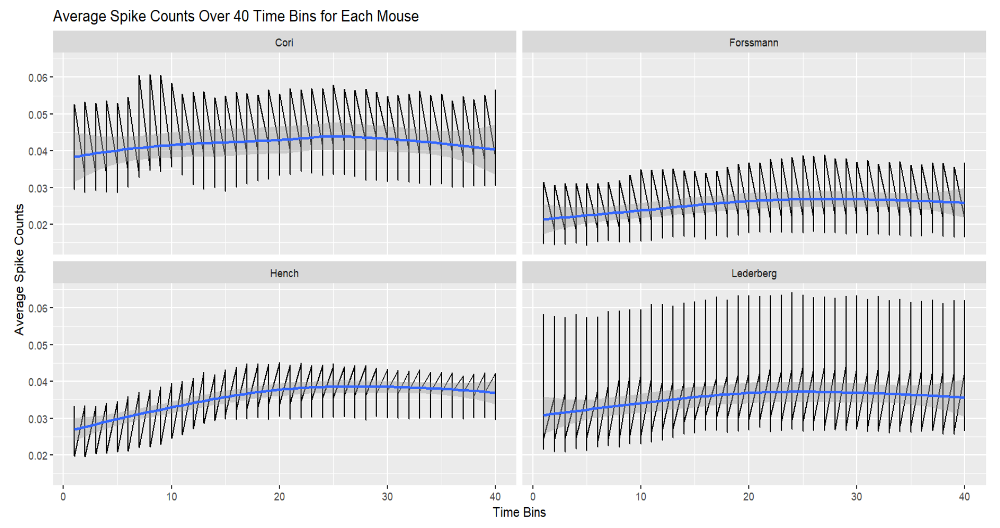
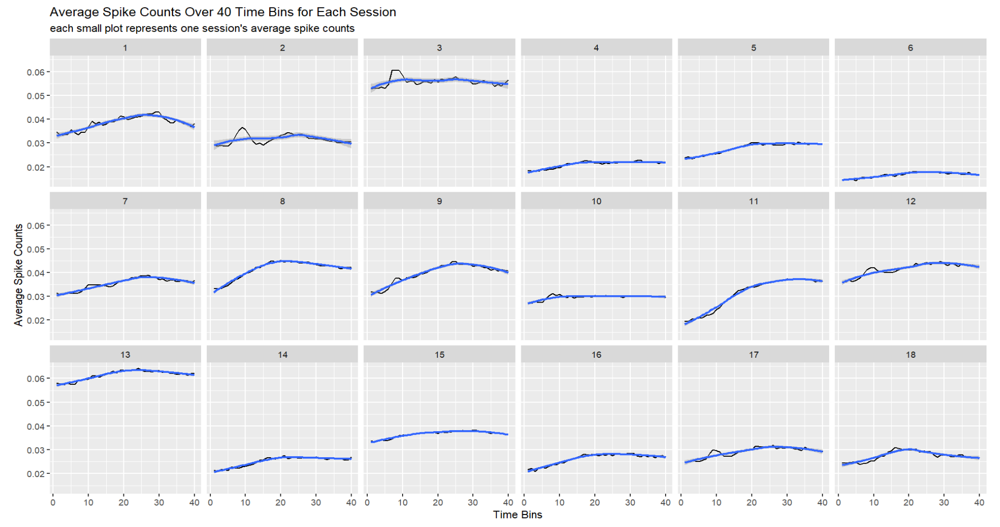

```{r echo=FALSE, eval=TRUE, message=FALSE}
suppressWarnings(library(tidyverse))
suppressWarnings(library(knitr))
suppressWarnings(library(dplyr))
suppressWarnings(library(ROCR))
suppressWarnings(library(caret))
suppressWarnings(library(gridExtra))
suppressWarnings(library(ggforce))
suppressWarnings(library(xgboost))
suppressWarnings(library(pROC))
suppressWarnings(library(randomForest))
suppressWarnings(library(kableExtra))
suppressWarnings(library(plotly))

```

```{r include=F}
session=list()
for(i in 1:18){
  session[[i]]=readRDS(paste('./Data/session',i,'.rds',sep=''))
}

```


# Abstract

The purpose of this project was to construct a predictive model that could best predict the outcome of a trial, given the available dataset. Through exploratory data analysis, I focused on aggregating the neural activity data using average spike counts across the time bins. I found that these spike counts changed across mice and sessions, differed between success and failure trials, and based on the condition of the visual stimuli in the task (to be explained below). I also noticed that a subset of time bins seemed to be more telling of a trial's success or failure, than all 40 time bins. This led me to build 8 prediction models (not including the baseline naive model), after integrating the data I needed.  

# Section 1 Introduction 

For this course project, the dataset that I worked with is a cleaned dataset, originating from Steinmetz, Zatka-Haas, Carandini, and Harris's 2019 article titled *Distributed coding of choice, action and engagement across the mouse brain*. During the study, Neuropixels probes were used to record the neural activity in the mice's brains. A total of 18 sessions of experiments were conducted on different days, and 4 mice participated: Cori, Forssmann, Hench, and Lederberg.   

As a brief introduction, the dataset contains 5 features (`contrast_left`, `contrast_right`, `time`, `spks`, and `brain_area`) and 1 binary outcome variable (`feedback_type`) for each trial in each session. Therefore, the goal here is to build a binary classification model.   

For all the trials within the same session, the matrices of the `spks` feature that contain the spike trains are of the same dimensions. The total number of rows of the matrix represent the total number of neurons in each trial, while each of the columns directly corresponds to the center of time bins given in the `time` feature for each trial. Additionally, `contrast_left` and `contrast_right` are just contrast of the stimuli on different sides.     

Finally, as promised above, the condition of the visual stimuli has 4 possibilities. From this point on, the group Condition 1 refers to `contrast_left` being greater than `contrast_right`. Condition 2 refers to `contrast_left` being less than `contrast_right`. Condition 3 refers to `contrast_left` and `contrast_right` both being 0. And Condition 4 refers to both contrasts being equal but not 0.  


# Section 2 Exploratory analysis    

My exploratory analysis begins with creating a dataframe to summarize the information across the 18 sessions for the 4 mice, which is converted into the table shown below. Each row represents a different session. The `Name of Mouse` column contains the name of the mouse associated with each session. The `Date of Experiment` column contains the date that each experiment was conducted. The `Number of Neurons` column contains the total number of neurons from which the number of spikes are recorded. The `Number of Trials` column contains the total number of trials conducted within each session. The `Success Rate` column contains the mouse's proportion of success trials (when outcome of the trial is 1) for each session. This rate is calculated by converting the original `feedback_type` vectors from 1 for success and -1 for failure, to 1 for success and 0 for failure, then taking the mean of those converted values. I will not be focusing on the brain areas part of the dataset, so I haven't included it as summary information here.    

```{r include=F}
n.session=length(session) 

# initialize empty dataframe
sess_smry <- data.frame(
  sess_num = rep(0,n.session),
  mouse_name = rep('name',n.session),
  date_exp =rep('dt',n.session),
  n_neurons = rep(0,n.session),
  n_trials = rep(0,n.session),
  success_rate = rep(0,n.session)
)

# fill in with summary info
for(i in 1:n.session){ 
  tmp = session[[i]]
  sess_smry[i,1]=i
  sess_smry[i,2]=tmp$mouse_name
  sess_smry[i,3]=tmp$date_exp
  sess_smry[i,4]=dim(tmp$spks[[1]])[1] 
  sess_smry[i,5]=length(tmp$feedback_type) 
  sess_smry[i,6]=mean((tmp$feedback_type+1)/2)
}

head(sess_smry)

```

```{r echo=F}
# print summary info table
kable(sess_smry, format="html", table.attr="class='table table-striped'", 
      digits=4,
      col.names=c("Session Number", "Name of Mouse", "Date of Experiment", 
                    "Number of Neurons", "Number of Trials",
                  paste0("Success Rate", footnote_marker_number(1))),
      caption="Summary Information Across 18 Sessions for the 4 Mice",
      align = "c", escape=F) %>%
  footnote(number=c("proportion of successful trials (feedback type is 1)"))
```

I can see that the number of neurons differs across sessions, with the least number of neurons in session 16, and the most in session 4. Since the amount of neurons differs, I will probably have to choose a summary statistic that can account for that, but still be representative of the neural data. I can also see that the number of trials differs too. Specifically, session 1 and 18 have the least number of trials, but that's because 100 trials from each were randomly removed for the test sets. The most number of trials is in session 10. The success rates are different for each session, and are calculated from the feedback types suggest a general increase in success rate over time for all 4 mice. Additionally, there's not an even amount of sessions for each mouse. For instance, Cori only has 3 sessions (sessions 1-3), while Lederberg has 7 sessions (sessions 12-18), which could indicate that session number and/or mouse name will be important in the predictive model.     

Since the success rate differs for all the sessions, I was interested in developing a baseline success rate for a group of sessions, particularly grouped by who the mouse was. Here are the baseline rates:  
```{r include=F}
success_mouse = sess_smry %>% group_by(mouse_name) %>% summarize(success_rate = mean(success_rate))
success_mouse
```

```{r echo=F}
# print nicely
dt_footnote = success_mouse
kable(dt_footnote, format="html", 
      table.attr="class='table table-striped'", digits=4,
      col.names=c("Mouse Name", 
                  paste0("Success Rate", footnote_marker_number(1))),
      caption="Average Success Rate for Each of the 4 Mice",
      align = "c", escape=F) %>%
  footnote(number=c("took average of success rates over each mouse's sessions"))%>%
kable_styling(full_width = F) 

```

Cori's overall success rate seems to be lowest, while Lederberg's overall success rate seems to be highest. This reinforces the fact that the success rates are not consistent across mice, as suspected, so I will dive deeper into the mice's sessions to look for more common trends or patterns within the neural data itself. Based on this table, I intend for my predictive models to at least be better than its corresponding mouse's success rate. This means my intended model for test data from session 1 should have higher accuracy than 0.6337. And my intended model for test data from session 18 should have higher accuracy than 0.7639.  


As hinted at in the analysis of the first table and to dive deeper into the mice's sessions patterns, I ultimately chose to take the average number of spikes (i.e. the average spike count) across neurons at each of the 40 time bins as the neural activities to keep analyzing for the remainder of this report. I thought of using the average because it takes into account the varying number of neurons in each session, and is therefore more representative of a number than perhaps just the sum of the spike counts. Then, I can compare more fairly across sessions.       

To continue, I wanted to explore how average spike counts change over the 40 time bins, conditional on various factors, and if certain levels of those factors could be combined. To do this, I first explored how the average spike counts changed, conditional on the different mice.  
```{r include=F}
# all sessions
all_sess_avg_spks = c()
for(sess in 1:18){
  # 1 session
  num_trials = length(session[[sess]]$feedback_type)
  cnt_sum = 0
  for(trial in 1:num_trials){
    cnt_sum = cnt_sum + colMeans(session[[sess]]$spks[[trial]])
  }
  one_sess_avg_spks = cnt_sum / num_trials

  all_sess_avg_spks = c(all_sess_avg_spks, one_sess_avg_spks)
}

mouse_nms = c(rep("Cori",3), rep("Forssmann",4),
              rep("Hench",4), rep("Lederberg",7))

avg_spks = data.frame(session_id = rep(1:18, each=40),
                      time_bin = rep(1:40, 18),
                      avg_spk_count = all_sess_avg_spks,
                      mouse_name = rep(mouse_nms, each=40))
# avg_spks

ggplot(avg_spks, aes(x = time_bin, y = avg_spk_count)) +
  geom_line()+
  geom_smooth(method = "loess")+  # Fit a smooth spline
  facet_wrap(~mouse_name) +
  labs(title = "Average Spike Counts Over 40 Time Bins for Each Mouse")+
  xlab("Time Bins")+ ylab("Average Spike Counts")

```



From this plot, I see a lot of variability from one time bin to another; the average spike count values keep fluctuating up and down. While the curves of best fit seem to be similarly shaped, their positions along the y-axis vary. Cori's plot seems the most different, with the highest average spike count across the time bins. Forssmann and Lederberg's plots seem to show more consistency in average spike counts, with a slight increase over time, but Lederberg's average spike counts vary a lot more. Finally, Hench's plot has the most noticeable trend of increase in average spike count. This seemed to me that some aspect of mouse name might be important to address in creating the predictive models. However, at the same time, due to the noticeable variability, the patterns across sessions instead of just across mice might hold more value for the prediction models if more similar patterned sessions could be analyzed together, which is the goal of the next few plots.  

The average spike counts over time could differ not just between mice, but even between sessions for the same mouse, so I plotted the average spike counts over the 40 times bins for each of the 18 sessions to explore this.  
```{r include=F}
ggplot(avg_spks, aes(x = time_bin, y = avg_spk_count)) +
  geom_line()+
  geom_smooth(method = "loess")+  # Fit a smooth spline
  labs(title = "Average Spike Counts Over 40 Time Bins for Each Session",
       subtitle = "each small plot represents one session's average spike counts") +
  facet_wrap(~session_id,ncol=6)+
  xlab("Time Bins")+ ylab("Average Spike Counts")

```



Most of the sessions generally have an increasing trend, where average spike counts increase over the 40 time bins, but the average spike count values vary quite a bit, with some sessions like session 3 having higher counts and others like session 6 having lower counts. I also noticed that some sessions have more similar trends, such as sessions 1,8,9, and 11, as well as a lot of Lederberg's sessions (as a refresher, those are session 12-18). Because of this variation, it seems we might be able to combine some sessions to analyze their similar trends, so it's probably useful to keep the session number as part of the final predictive model. I would also argue that because of the clearer trend similarities and differences among various sessions, this variable will probably be more useful to keep than mouse name. However, these plots are still not as clear as I'd like because they provide no information about how those counts vary between success and failure trials, which is the outcome we're trying to predict.

Therefore, I decided to plot the average spike counts of the 18 sessions again but this time separate them by success and failure trials, one line of best fit for each on every smaller plot.  
```{r include=F}
# all sessions, success trials
all_sess_avg_spks_S = c()
for(sess in 1:18){
  # 1 session
  num_trials = length(session[[sess]]$feedback_type)
  cnt_sum = 0
  for(trial in 1:num_trials){
    if(session[[sess]]$feedback_type[trial] == 1){ # feedback=success
      cnt_sum = cnt_sum + colMeans(session[[sess]]$spks[[trial]])
    }
  }
  one_sess_avg_spks = cnt_sum / sum(session[[sess]]$feedback_type == 1)

  all_sess_avg_spks_S = c(all_sess_avg_spks_S, one_sess_avg_spks)
}

# all sessions, fail trials
all_sess_avg_spks_F = c()
for(sess in 1:18){
  # 1 session
  num_trials = length(session[[sess]]$feedback_type)
  cnt_sum = 0
  for(trial in 1:num_trials){
    if(session[[sess]]$feedback_type[trial] == -1){ # feedback=fail
      cnt_sum = cnt_sum + colMeans(session[[sess]]$spks[[trial]])
    }
  }
  one_sess_avg_spks = cnt_sum / sum(session[[sess]]$feedback_type == -1)

  all_sess_avg_spks_F = c(all_sess_avg_spks_F, one_sess_avg_spks)
}

avg_spks_feedback = data.frame(session_id = rep(1:18, each=40),
                      time_bin = rep(1:40, 18),
                      avg_spk_count_S = all_sess_avg_spks_S,
                      avg_spk_count_F = all_sess_avg_spks_F)
# avg_spks_feedback

p = ggplot(avg_spks_feedback) +
  geom_line(aes(x = time_bin, y = avg_spk_count_S, color = "Success"))+
  geom_smooth(aes(x = time_bin, y = avg_spk_count_S, color = "Success"), 
              method = "loess") +  # Fit a smooth spline
  geom_line(aes(x = time_bin, y = avg_spk_count_F, color = "Failure"))+
  geom_smooth(aes(x = time_bin, y = avg_spk_count_F, color = "Failure"), 
              method = "loess") +
  facet_wrap(~session_id,ncol=6) +
  labs(title="Average Spike Counts Separated by Success and Failure Trials") +
  scale_color_manual(values = c("Success" = "blue", "Failure" = "red")) +
  theme(legend.position = "right") +
  xlab("Time Bins")+ 
  ylab("Average Spike Counts") +
  guides(color = guide_legend(title = "Trial Outcome"))

p = suppressWarnings(p %>% plotly::ggplotly())
```

```{r echo=F}
p
```

From this plot, I discovered a few things. One, I wasn't expecting this, but I start to see a larger gap (most difference) between the average spike counts for success and failure trials across most of the sessions at around time bin 15. Therefore, I believe that the time bins matter in determining the trial outcomes, and I can try reducing the amount of time bins to use in the final prediction model to only time bins 15 to 40. Two, from what I can see, there's a noticeable difference in average spike counts between failure and success trials for most if not all the sessions. The main pattern is that success trials mostly have a higher average spike count across time than failure trials. Three, although this main pattern is seen, I also noticed that sessions for the same mouse did not all have the same average spike counts values, such as session 13 vs session 14 which are both from Lederberg having very different values. 

This means that even if trials in these sessions have similar trends like in session 13 and 14, the model might still predict completely incorrect outcomes. For instance, for session 13, an average spike count of 0.03 would be considered a failure trial, but for session 14, that same value would be considered a success outcome. This suggests two things to me. The first is that I should be choosing sessions that have similar trends to sessions 1 and 18, and build 2 separate predictive models for each one, because training on similar data would be more useful for testing accuracy than training on a variety of data with different trends. And secondly, I will adjust the average spike counts so that similar trends will have their counts at similar values.  

Since a part of the test data will come from the first session and the trends between session 1-3 seem comparable, I'm first looking more closely at Cori's sessions (1-3). Continuing with splitting by success and failure trials, here's the plot after adjusting the average spike counts to be at similar values:  
```{r include=F}
# all sessions, success trials
all_sess_avg_spks_S = c()
for(sess in 1:3){
  # 1 session
  num_trials = length(session[[sess]]$feedback_type)
  cnt_sum = 0
  for(trial in 1:num_trials){
    if(session[[sess]]$feedback_type[trial] == 1){ # feedback=success
      cnt_sum = cnt_sum + colMeans(session[[sess]]$spks[[trial]])
    }
  }
  one_sess_avg_spks = cnt_sum / sum(session[[sess]]$feedback_type == 1)
  
  # if session 2:
  if(sess == 2){
    one_sess_avg_spks = one_sess_avg_spks + 0.005
  }
    # if session 3:
  if(sess == 3){
    one_sess_avg_spks = one_sess_avg_spks - 0.02
  }

  all_sess_avg_spks_S = c(all_sess_avg_spks_S, one_sess_avg_spks)
}

# all sessions, fail trials
all_sess_avg_spks_F = c()
for(sess in 1:3){
  # 1 session
  num_trials = length(session[[sess]]$feedback_type)
  cnt_sum = 0
  for(trial in 1:num_trials){
    if(session[[sess]]$feedback_type[trial] == -1){ # feedback=fail
      cnt_sum = cnt_sum + colMeans(session[[sess]]$spks[[trial]])
    }
  }
  one_sess_avg_spks = cnt_sum / sum(session[[sess]]$feedback_type == -1)
  
  # if session 2:
  if(sess == 2){
    one_sess_avg_spks = one_sess_avg_spks + 0.005
  }
  # if session 3:
  if(sess == 3){
    one_sess_avg_spks = one_sess_avg_spks - 0.02
  }

  all_sess_avg_spks_F = c(all_sess_avg_spks_F, one_sess_avg_spks)
}

avg_spks_feedback = data.frame(session_id = rep(1:3, each=40),
                      time_bin = rep(1:40, 3),
                      avg_spk_count_S = all_sess_avg_spks_S,
                      avg_spk_count_F = all_sess_avg_spks_F)
# avg_spks_feedback

p = ggplot(avg_spks_feedback) +
  geom_line(aes(x = time_bin, y = avg_spk_count_S, color = "Success"))+
  geom_smooth(aes(x = time_bin, y = avg_spk_count_S, color = "Success"), 
              method = "loess") +  # Fit a smooth spline
  geom_line(aes(x = time_bin, y = avg_spk_count_F, color = "Failure"))+
  geom_smooth(aes(x = time_bin, y = avg_spk_count_F, color = "Failure"), 
              method = "loess") +
  facet_wrap(~session_id) +
  labs(title="Average Spike Counts for Session 1-3") +
  scale_color_manual(values = c("Success" = "blue", "Failure" = "red")) +
  theme(legend.position = "right")+
  xlab("Time Bins")+ 
  ylab("Average Spike Counts") +
  guides(color = guide_legend(title = "Trial Outcome"))

p = suppressWarnings(p %>% plotly::ggplotly())
```

```{r echo=F}
p
```

This plot shows me that the failure trend lines are arguably similar, but perhaps the success trend lines may be less similar, because in session 1, there seems to be a relatively larger peak at around time bin 25, whereas the other sessions don't peak as high. However, since these 3 sessions are from the same mouse, Cori, I will not disgard their data just yet, but keep it to try fitting a model on, in case there's no better, more accurate alternative model.  

Since a part of the test data will also come from the last session (18), and the trends between session 12-18 seem comparable, I'm going to next take a look at Lederberg's sessions 12-18. Continuing with splitting by success and failure trials, here's another plot after adjusting the average spike counts to be at similar values:  
```{r include=F}
# all sessions, success trials
all_sess_avg_spks_S = c()
for(sess in 12:18){
  # 1 session
  num_trials = length(session[[sess]]$feedback_type)
  cnt_sum = 0
  for(trial in 1:num_trials){
    if(session[[sess]]$feedback_type[trial] == 1){ # feedback=success
      cnt_sum = cnt_sum + colMeans(session[[sess]]$spks[[trial]])
    }
  }
  one_sess_avg_spks = cnt_sum / sum(session[[sess]]$feedback_type == 1)
  
  if(sess == 12){
    one_sess_avg_spks = one_sess_avg_spks - 0.005
  }
  if(sess == 13){
    one_sess_avg_spks = one_sess_avg_spks - 0.025
  }
  if(sess == 14){
    one_sess_avg_spks = one_sess_avg_spks + 0.01
  }
  if(sess == 16){
    one_sess_avg_spks = one_sess_avg_spks + 0.01
  }
  if(sess == 17){
    one_sess_avg_spks = one_sess_avg_spks + 0.005
  }
  if(sess == 18){
    one_sess_avg_spks = one_sess_avg_spks + 0.0075
  }

  all_sess_avg_spks_S = c(all_sess_avg_spks_S, one_sess_avg_spks)
}

# all sessions, fail trials
all_sess_avg_spks_F = c()
for(sess in 12:18){
  # 1 session
  num_trials = length(session[[sess]]$feedback_type)
  cnt_sum = 0
  for(trial in 1:num_trials){
    if(session[[sess]]$feedback_type[trial] == -1){ # feedback=fail
      cnt_sum = cnt_sum + colMeans(session[[sess]]$spks[[trial]])
    }
  }
  one_sess_avg_spks = cnt_sum / sum(session[[sess]]$feedback_type == -1)
  
  if(sess == 12){
    one_sess_avg_spks = one_sess_avg_spks - 0.005
  }
  if(sess == 13){
    one_sess_avg_spks = one_sess_avg_spks - 0.025
  }
  if(sess == 14){
    one_sess_avg_spks = one_sess_avg_spks + 0.01
  }
  if(sess == 16){
    one_sess_avg_spks = one_sess_avg_spks + 0.01
  }
  if(sess == 17){
    one_sess_avg_spks = one_sess_avg_spks + 0.005
  }
  if(sess == 18){
    one_sess_avg_spks = one_sess_avg_spks + 0.0075
  }

  all_sess_avg_spks_F = c(all_sess_avg_spks_F, one_sess_avg_spks)
}

avg_spks_feedback = data.frame(session_id = rep(12:18, each=40),
                      time_bin = rep(1:40, 7),
                      avg_spk_count_S = all_sess_avg_spks_S,
                      avg_spk_count_F = all_sess_avg_spks_F)
# avg_spks_feedback

p = ggplot(avg_spks_feedback) +
  geom_line(aes(x = time_bin, y = avg_spk_count_S, color = "Success"))+
  geom_smooth(aes(x = time_bin, y = avg_spk_count_S, color = "Success"), 
              method = "loess") +  # Fit a smooth spline
  geom_line(aes(x = time_bin, y = avg_spk_count_F, color = "Failure"))+
  geom_smooth(aes(x = time_bin, y = avg_spk_count_F, color = "Failure"), 
              method = "loess") +
  facet_wrap(~session_id, ncol=4) +
  labs(title="Average Spike Counts for Session 12-18") +
  scale_color_manual(values = c("Success" = "blue", "Failure" = "red")) +
  theme(legend.position = "right")+
  xlab("Time Bins")+ 
  ylab("Average Spike Counts") +
  guides(color = guide_legend(title = "Trial Outcome"))

p = suppressWarnings(p %>% plotly::ggplotly())
```

```{r echo=F}
p
```

From this plot, I can see that the zoomed-in trend lines for both success and failure outcomes in session 18 are quite unique, so the closest patterns I can see are the other Lederberg sessions shown above. The patterns across sessions 12-17 are still decently similar because their success trials essentially all form a steep increase in average spike counts, then start decreasing in a similar fashion. As for the failure trials, the main consensus among the trends was that they mostly still maintained a lower average spike count than success trials and the larger gap in later time bins was quite noteworthy. Also because they are all from Lederberg, they are most reasonable to use in the predictive models.  

Next, to circle back to having another option for session 1's predictive model, I've looked more closely at the average spike count trends across sessions (separated by success and failure), and it seems to me that sesssion 8, 9, and 11 might also have similar trends to session 1. Again, I've continued with splitting by success and failure trials, and here's another plot after adjusting the average spike counts to be at similar values:   
```{r include=F}
# all sessions, success trials
all_sess_avg_spks_S = c()
for(sess in c(1,8,9,11)){
  # 1 session
  num_trials = length(session[[sess]]$feedback_type)
  cnt_sum = 0
  for(trial in 1:num_trials){
    if(session[[sess]]$feedback_type[trial] == 1){ # feedback=success
      cnt_sum = cnt_sum + colMeans(session[[sess]]$spks[[trial]])
    }
  }
  one_sess_avg_spks = cnt_sum / sum(session[[sess]]$feedback_type == 1)

  if(sess == 11){
    one_sess_avg_spks = one_sess_avg_spks + 0.01
  }

  all_sess_avg_spks_S = c(all_sess_avg_spks_S, one_sess_avg_spks)
}

# all sessions, fail trials
all_sess_avg_spks_F = c()
for(sess in c(1,8,9,11)){
  # 1 session
  num_trials = length(session[[sess]]$feedback_type)
  cnt_sum = 0
  for(trial in 1:num_trials){
    if(session[[sess]]$feedback_type[trial] == -1){ # feedback=fail
      cnt_sum = cnt_sum + colMeans(session[[sess]]$spks[[trial]])
    }
  }
  one_sess_avg_spks = cnt_sum / sum(session[[sess]]$feedback_type == -1)
  
  if(sess == 11){
    one_sess_avg_spks = one_sess_avg_spks + 0.01
  }

  all_sess_avg_spks_F = c(all_sess_avg_spks_F, one_sess_avg_spks)
}

avg_spks_feedback = data.frame(session_id = rep(c(1,8,9,11), each=40),
                      time_bin = rep(1:40, 4),
                      avg_spk_count_S = all_sess_avg_spks_S,
                      avg_spk_count_F = all_sess_avg_spks_F)
# avg_spks_feedback

p = ggplot(avg_spks_feedback) +
  geom_line(aes(x = time_bin, y = avg_spk_count_S, color = "Success"))+
  geom_smooth(aes(x = time_bin, y = avg_spk_count_S, color = "Success"), 
              method = "loess") +  # Fit a smooth spline
  geom_line(aes(x = time_bin, y = avg_spk_count_F, color = "Failure"))+
  geom_smooth(aes(x = time_bin, y = avg_spk_count_F, color = "Failure"), 
              method = "loess") +
  facet_wrap(~session_id) +
  labs(title="Average Spike Counts for Session 1,8,9,11") +
  scale_color_manual(values = c("Success" = "blue", "Failure" = "red")) +
  theme(legend.position = "right")+
  xlab("Time Bins")+ 
  ylab("Average Spike Counts") +
  guides(color = guide_legend(title = "Trial Outcome"))

p = suppressWarnings(p %>% plotly::ggplotly())
```

```{r echo=F}
p
```

From this plot, I can see that the zoomed-in trend lines for both success and failure outcomes in these four subplots are arguably more similar than before, but now it's not just from Cori, but also from Hench. In this case, I think using another mouse's data can be useful in getting more training data, as the trends are quite similar, indicating that it's not just random unrelated data that I'm adding to the predictive model. The patterns across sessions 12-17 are still decently similar because their success trials essentially all form a steep increase in average spike counts, then start decreasing in a similar fashion. And the failure trials are a bit flatter, while the gap between failure and success trials becomes larger as time bins increase, indicating that again, we could try only using the later time bins in our predictive model because that's where the failure and success trials start to more noticeably be able to be separated.  

Furthermore, I wanted to explore if I could get some information about the visual stimuli and see if I could combine any conditions with similar trends to potentially reduce model complexity, through seeing if there's a difference in average spike counts across the 4 conditions explained in the introduction. I chose to capture this potential difference by switching from just average spike counts on the y-axis to the difference between the success and failure trials' average spike counts (meaning success minus failure average spike counts), in order to make the plot look less chaotic.  
```{r include=F}
all_diff_1 = c()
all_diff_2 = c()
all_diff_3 = c()
all_diff_4 = c()
# sess=18
for(sess in 1:3){
  cnt_sum1s = 0
  cnt1s = 0
  cnt_sum1f = 0
  cnt1f = 0
  cnt_sum2s = 0
  cnt2s = 0
  cnt_sum2f = 0
  cnt2f = 0
  cnt_sum3s = 0
  cnt3s = 0
  cnt_sum3f = 0
  cnt3f = 0
  cnt_sum4s = 0
  cnt4s = 0
  cnt_sum4f = 0
  cnt4f = 0
  condition_indices1 = which(session[[sess]]$contrast_left > 
                              session[[sess]]$contrast_right)
  condition_indices2 = which(session[[sess]]$contrast_left <
                              session[[sess]]$contrast_right)
  condition_indices3 = which(session[[sess]]$contrast_left ==
                              session[[sess]]$contrast_right &
                              session[[sess]]$contrast_left == 0)
  condition_indices4 = which(session[[sess]]$contrast_left ==
                              session[[sess]]$contrast_right &
                              session[[sess]]$contrast_left != 0)
  for(trial in condition_indices1){
    if(session[[sess]]$feedback_type[trial] == 1){ # success
      cnt_sum1s = cnt_sum1s + colMeans(session[[sess]]$spks[[trial]])
      cnt1s = cnt1s + 1
    } else{
      cnt_sum1f = cnt_sum1f + colMeans(session[[sess]]$spks[[trial]])
      cnt1f = cnt1f + 1
    }
  }
  for(trial in condition_indices2){
    if(session[[sess]]$feedback_type[trial] == 1){ # success
      cnt_sum2s = cnt_sum2s + colMeans(session[[sess]]$spks[[trial]])
      cnt2s = cnt2s + 1
    } else{
      cnt_sum2f = cnt_sum2f + colMeans(session[[sess]]$spks[[trial]])
      cnt2f = cnt2f + 1
    }
  }
  for(trial in condition_indices3){
    if(session[[sess]]$feedback_type[trial] == 1){ # success
      cnt_sum3s = cnt_sum3s + colMeans(session[[sess]]$spks[[trial]])
      cnt3s = cnt3s + 1
    } else{
      cnt_sum3f = cnt_sum3f + colMeans(session[[sess]]$spks[[trial]])
      cnt3f = cnt3f + 1
    }
  }
  for(trial in condition_indices4){
    if(session[[sess]]$feedback_type[trial] == 1){ # success
      cnt_sum4s = cnt_sum4s + colMeans(session[[sess]]$spks[[trial]])
      cnt4s = cnt4s + 1
    } else{
      cnt_sum4f = cnt_sum4f + colMeans(session[[sess]]$spks[[trial]])
      cnt4f = cnt4f + 1
    }
  }
  one_sess_avg_spks1s = cnt_sum1s / cnt1s
  one_sess_avg_spks1f = cnt_sum1f / cnt1f
  cond_diff1 = one_sess_avg_spks1s - one_sess_avg_spks1f
  one_sess_avg_spks2s = cnt_sum2s / cnt2s
  one_sess_avg_spks2f = cnt_sum2f / cnt2f
  cond_diff2 = one_sess_avg_spks2s - one_sess_avg_spks2f
  one_sess_avg_spks3s = cnt_sum3s / cnt3s
  one_sess_avg_spks3f = cnt_sum3f / cnt3f
  cond_diff3 = one_sess_avg_spks3s - one_sess_avg_spks3f
  one_sess_avg_spks4s = cnt_sum4s / cnt4s
  one_sess_avg_spks4f = cnt_sum4f / cnt4f
  cond_diff4 = one_sess_avg_spks4s - one_sess_avg_spks4f
  
  # cond_sf = avg_spks %>% filter(session_id == 1)
  # cond_sf = cbind(cond_sf, cond_diff1)
  # cond_sf = cbind(cond_sf, cond_diff2)
  # cond_sf = cbind(cond_sf, cond_diff3)
  # cond_sf = cbind(cond_sf, cond_diff4)
  
  all_diff_1 = c(all_diff_1, cond_diff1)
  all_diff_2 = c(all_diff_2, cond_diff2)
  all_diff_3 = c(all_diff_3, cond_diff3)
  all_diff_4 = c(all_diff_4, cond_diff4)
}

cond_sf = data.frame(cond_diff1 = all_diff_1, 
                  cond_diff2 = all_diff_2, 
                  cond_diff3 = all_diff_3,
                  cond_diff4 = all_diff_4)
cond_sf = cbind(avg_spks, cond_sf)

p = ggplot(cond_sf) +
    geom_line(aes(x = time_bin, y = cond_diff1, color = "Condition 1"))+
    geom_smooth(aes(x = time_bin, y = cond_diff1, color = "Condition 1"),
                method = "loess") +  # Fit a smooth spline
    geom_line(aes(x = time_bin, y = cond_diff2, color = "Condition 2"))+
    geom_smooth(aes(x = time_bin, y = cond_diff2, color = "Condition 2"),
                method = "loess") +
    geom_line(aes(x = time_bin, y = cond_diff3, color = "Condition 3"))+
    geom_smooth(aes(x = time_bin, y = cond_diff3, color = "Condition 3"),
                method = "loess") +  # Fit a smooth spline
    geom_line(aes(x = time_bin, y = cond_diff4, color = "Condition 4"))+
    geom_smooth(aes(x = time_bin, y = cond_diff4, color = "Condition 4"),
                method = "loess") +
  facet_wrap(~session_id, ncol=5) +
  labs(title = "Difference in Average Spike Counts Separated by 4 Conditions") +
  xlab("Time Bins")+ 
  ylab("Success Minus Failure Trials Average Spike Counts") +
  guides(color = guide_legend(title = "Conditions"))
p = suppressWarnings(p %>% plotly::ggplotly())
```

```{r echo=F}
p
```

Overall, Condition 4 does not seem like it fits the pattern of the other conditions, so I will not combine that with other conditions. Condition 3 also has the same issue, so that will still be kept separate as well. However, based on these plots, it seems that oftentimes Condition 1 and 2 (the conditions where left and right stimuli contrasts are not equal) seem quite similar in terms of the line of best fit's shape and position, so I'll probably explore combining those conditions in my predictive models. (I noticed that sessions 1, 4, 7, 10, 13, and 16 seemed quite similar in terms of the trends of the 4 lines, but didn't have time to explain more than that.)  

To sum up this section, the main takeaways are that I will try fitting predictive models for Session 1. One way will be using Session 1-3, while the other way will be using Sessions 1,8,9,11. For the predictive model for Session 18, I will be using Sessions 12-18. And I will be combining Conditions 1 and 2 to see if model accuracy will improve.   


# Section 3 Data integration

I created 7 main dataframes in preparation for creating the predictive models. For all of them, `Feedback` is the outcome variable column, with values 1 for success and -1 for failure trials. I've also kept all the time bins because in the predictive model it will be relatively simple to only get a subset of the time bins for testing.     

This first and main dataframe contains the average spike counts for all 18 sessions, averaging the counts across the neurons in that trial at each of the 40 time bins. Each row is a trial, and I've kept the 4 conditions. This will help me build baseline models to compare to.    
```{r include=F}
# full_functional_tibble # 0.04905

df1 = data.frame(matrix(nrow=0,ncol=41))
binname = paste0("bin", as.character(1:40))

session_id = c()
trial_id = c()
feedback = c()
# contrast_left = c()
# contrast_right = c()
for(sess in 1:18){
  for(trial in 1:length(session[[sess]]$spks)){
    spks = session[[sess]]$spks[[trial]]
    avg_spks = matrix(colMeans(spks), nrow=1)
    # colnames(avg_spks) <- binname
    
    # condition
    if (session[[sess]]$contrast_left[trial] > 
        session[[sess]]$contrast_right[trial]){
      avg_spks = c(1, avg_spks)
    } else if (session[[sess]]$contrast_left[trial] < 
               session[[sess]]$contrast_right[trial]){
      avg_spks = c(2, avg_spks)
    } else if (session[[sess]]$contrast_left[trial] == 
               session[[sess]]$contrast_right[trial] 
               & session[[sess]]$contrast_left[trial] == 0){
      avg_spks = c(3, avg_spks)
    } else{
      avg_spks = c(4, avg_spks)
    }
    
    df1 = rbind(df1, avg_spks)
    session_id = c(session_id, sess)
    trial_id = c(trial_id, trial)
    feedback = c(feedback, session[[sess]]$feedback_type[trial])
    # contrast_left = c(contrast_left, session[[sess]]$contrast_left[trial])
    # contrast_right = c(contrast_right, session[[sess]]$contrast_right[trial])
  }
}
# df1
# df1 = cbind(contrast_right, df1)
# df1 = cbind(contrast_left, df1)
df1 = cbind(feedback, df1)
df1 = cbind(trial_id, df1)
df1 = cbind(session_id, df1)
df1$feedback = as.factor(df1$feedback)
df1$session_id = as.factor(df1$session_id)
colnames(df1)[4] = "condition"
colnames(df1)[5:44] = binname
df1$condition = as.factor(df1$condition)
# df1

mat1 = model.matrix(~., df1)
```

```{r echo=F}
# print nicely
dt_footnote = df1
binname = paste0("bin", as.character(2:10))
names(dt_footnote)[1] <- paste0(names(dt_footnote)[1], 
                                footnote_marker_symbol(1, "html"))
kable(dt_footnote[1:15,1:14], format="html", 
      table.attr="class='table table-striped'", digits=4,
      col.names=c(paste0("Session Number", footnote_marker_number(1)), 
                  paste0("Trial Number", footnote_marker_number(2)), 
                  "Feedback", "Condition",
                  paste0("bin1", footnote_marker_number(3)),
                  binname),
      caption="Data Integration of Average Spike Counts for All Sessions 
        Across All 40 Time Bins (first 15 rows, first 14 columns)",
      align = "c", escape=F) %>%
  footnote(general=
    c("This is a subset of a dataframe with 5081 rows and 44 columns"), 
    number = c("session numbers go from 1 to 18",
          "trial numbers go from 1 to the number of trials in that session",
          "time bins go from 1 to 40"))

```

The next dataframe is in preparation for Session 1's predictive model. It is the same as the dataframe above except instead of all 18 sessions, I have only included sessions 1-3, as concluded in the main takeaways of the exploratory data analysis. There are 4 conditions.    
```{r include=F}
sess1 = (df1 %>% filter(session_id == 1))[5:44]
sess2 = (df1 %>% filter(session_id == 2))[5:44] + 0.005
cori = rbind(sess1, sess2)
sess3 = (df1 %>% filter(session_id == 3))[5:44] - 0.02
cori = rbind(cori, sess3)
cori = cbind((df1 %>% filter(session_id %in% c(1:3)))[1:4], cori)
# cori

mat_cori = model.matrix(~., cori)

combcond_cori = cori
combcond_cori$condition = fct_collapse(combcond_cori$condition, "1" = c("1", "2"), "2"="3", "3"="4")
# combcond_cori
mat_combcond_cori = model.matrix(~., combcond_cori)
```

```{r echo=F}
# print nicely: cori
dt_footnote2 = cori
binname = paste0("bin", as.character(2:10))
names(dt_footnote2)[1] <- paste0(names(dt_footnote2)[1], 
                                footnote_marker_symbol(1, "html"))
kable(dt_footnote2[1:15,1:14], format="html", 
      table.attr="class='table table-striped'", digits=4,
      col.names=c(paste0("Session Number", footnote_marker_number(1)), 
                  paste0("Trial Number", footnote_marker_number(2)), 
                  "Feedback", 
                  "Condition",
                  paste0("bin1", footnote_marker_number(3)),
                  binname),
      caption="Data Integration of Average Spike Counts for Sessions 1-3
        (Cori's Sessions) Across All 40 Time Bins (first 15 rows, first 14 
        columns)",
      align = "c", escape=F) %>%
  footnote(general=
    c("This is a subset of a dataframe with 593 rows and 44 columns"), 
    number = c("session numbers go from 1 to 3",
          "trial numbers go from 1 to the number of trials in that session",
          "time bins go from 1 to 40"))
```

The third dataframe here is the same as the one above, except now I've combined conditions 1 and 2 into the new condition 1, for further testing in the predictive modeling phase. This also means the original condition 3 has become the new condition 2, and the original condition 4 has become the new condition 3.   
```{r echo=F}
# print nicely: cori combined condition
dt_footnote3 = combcond_cori
binname = paste0("bin", as.character(2:10))
names(dt_footnote3)[1] <- paste0(names(dt_footnote3)[1], 
                                footnote_marker_symbol(1, "html"))
kable(dt_footnote3[1:15,1:14], format="html", 
      table.attr="class='table table-striped'", digits=4,
      col.names=c(paste0("Session Number", footnote_marker_number(1)), 
                  paste0("Trial Number", footnote_marker_number(2)), 
                  "Feedback", "Condition",
                  paste0("bin1", footnote_marker_number(3)),
                  binname),
      caption="Same Data Integration as Table Above, Except Conditions 1 and 2
        are Combined into One Condition",
      align = "c", escape=F) %>%
  footnote(general=
    c("This is a subset of a dataframe with 593 rows and 44 columns"), 
    number = c("session numbers go from 1 to 3",
          "trial numbers go from 1 to the number of trials in that session",
          "time bins go from 1 to 40"))
```

The fourth dataframe is in preparation for Session 18's predictive model. It is the same as the main dataframe above except instead of all 18 sessions, I have only included sessions 12-18, as concluded in the main takeaways of the exploratory data analysis. There are four conditions.    
```{r include=F}
sess12 = (df1 %>% filter(session_id == 12))[5:44] - 0.005
sess13 = (df1 %>% filter(session_id == 13))[5:44] - 0.025
led = rbind(sess12, sess13)
sess14 = (df1 %>% filter(session_id == 14))[5:44] + 0.01
led = rbind(led, sess14)
sess15 = (df1 %>% filter(session_id == 15))[5:44]
led = rbind(led, sess15)
sess16 = (df1 %>% filter(session_id == 16))[5:44] + 0.01
led = rbind(led, sess16)
sess17 = (df1 %>% filter(session_id == 17))[5:44] + 0.005
led = rbind(led, sess17)
sess18 = (df1 %>% filter(session_id == 18))[5:44] + 0.0075
led = rbind(led, sess18)
led = cbind((df1 %>% filter(session_id %in% c(12:18)))[1:4], led)
# led

mat_led = model.matrix(~., led)

combcond_led = led
combcond_led$condition = fct_collapse(combcond_led$condition, "1" = c("1", "2"), "2"="3", "3"="4")
# combcond_led
mat_combcond_led = model.matrix(~., combcond_led)
```

```{r echo=F}
# print nicely: lederberg
dt_footnote4 = led
binname = paste0("bin", as.character(2:10))
names(dt_footnote4)[1] <- paste0(names(dt_footnote4)[1], 
                                footnote_marker_symbol(1, "html"))
kable(dt_footnote4[1:15,1:14], format="html", 
      table.attr="class='table table-striped'", digits=4,
      col.names=c(paste0("Session Number", footnote_marker_number(1)), 
                  paste0("Trial Number", footnote_marker_number(2)), 
                  "Feedback", "Condition",
                  paste0("bin1", footnote_marker_number(3)),
                  binname),
      caption="Data Integration of Average Spike Counts for Sessions 12-18
        (Lederberg's Sessions) Across All 40 Time Bins (first 15 rows, first 14 
        columns)",
      align = "c", escape=F) %>%
  footnote(general=
    c("This is a subset of a dataframe with 2032 rows and 44 columns"), 
    number = c("session numbers go from 12 to 18",
          "trial numbers go from 1 to the number of trials in that session",
          "time bins go from 1 to 40"))
```

The fifth dataframe here is the same as the fourth one, except now I've again combined conditions 1 and 2 into the new condition 1, for further testing in the predictive modeling phase. This also means the original condition 3 has become the new condition 2, and the original condition 4 has become the new condition 3.  
```{r echo=F}
# print nicely: lederberg combined conditions
dt_footnote5 = combcond_led
binname = paste0("bin", as.character(2:10))
names(dt_footnote5)[1] <- paste0(names(dt_footnote5)[1], 
                                footnote_marker_symbol(1, "html"))
kable(dt_footnote5[1:15,1:14], format="html", 
      table.attr="class='table table-striped'", digits=4,
      col.names=c(paste0("Session Number", footnote_marker_number(1)), 
                  paste0("Trial Number", footnote_marker_number(2)), 
                  "Feedback", "Condition",
                  paste0("bin1", footnote_marker_number(3)),
                  binname),
      caption="Same Data Integration as Table Above, Except Conditions 1 and 2
        are Combined into One Condition",
      align = "c", escape=F) %>%
  footnote(general=
    c("This is a subset of a dataframe with 2032 rows and 44 columns"), 
    number = c("session numbers go from 12 to 18",
          "trial numbers go from 1 to the number of trials in that session",
          "time bins go from 1 to 40"))
```

The sixth dataframe is in preparation for Session 1's alternative predictive model. It is the same as the main dataframe above except instead of all 18 sessions, I have only included sessions 1,8,9,11, as concluded in the main takeaways of the exploratory data analysis. There are four conditions.    
```{r include=F}
sess1 = (df1 %>% filter(session_id == 1))[5:44]
sess8 = (df1 %>% filter(session_id == 8))[5:44]
cori2 = rbind(sess1, sess8)
sess9 = (df1 %>% filter(session_id == 9))[5:44]
cori2 = rbind(cori2, sess9)
sess11 = (df1 %>% filter(session_id == 11))[5:44] + 0.01
cori2 = rbind(cori2, sess11)
cori2 = cbind((df1 %>% filter(session_id %in% c(1,8,9,11)))[1:4], cori2)
cori2

mat_cori2 = model.matrix(~., cori2)

combcond_cori2 = cori2
combcond_cori2$condition = fct_collapse(combcond_cori2$condition, "1" = c("1", "2"), "2"="3", "3"="4")
combcond_cori2
mat_combcond_cori2 = model.matrix(~., combcond_cori2)
```

```{r echo=F}
# print nicely: cori2
dt_footnote6 = cori2
binname = paste0("bin", as.character(2:10))
names(dt_footnote6)[1] <- paste0(names(dt_footnote6)[1], 
                                footnote_marker_symbol(1, "html"))
kable(dt_footnote6[1:15,1:14], format="html", 
      table.attr="class='table table-striped'", digits=4,
      col.names=c(paste0("Session Number", footnote_marker_number(1)), 
                  paste0("Trial Number", footnote_marker_number(2)), 
                  "Feedback", "Condition",
                  paste0("bin1", footnote_marker_number(3)),
                  binname),
      caption="Data Integration of Average Spike Counts for Sessions 1,8,9,11
        Across All 40 Time Bins (first 15 rows, first 14 columns)",
      align = "c", escape=F) %>%
  footnote(general=
    c("This is a subset of a dataframe with 1078 rows and 44 columns"), 
    number = c("session numbers are 1,8,9,11",
          "trial numbers go from 1 to the number of trials in that session",
          "time bins go from 1 to 40"))
```

Finally, the seventh dataframe here is the same as the sixth one, except now I've again combined conditions 1 and 2 into the new condition 1, for further testing in the predictive modeling phase. This also means the original condition 3 has become the new condition 2, and the original condition 4 has become the new condition 3.   
```{r echo=F}
# print nicely: cori2 combined conditions
dt_footnote7 = combcond_cori2
binname = paste0("bin", as.character(2:10))
names(dt_footnote7)[1] <- paste0(names(dt_footnote7)[1], 
                                footnote_marker_symbol(1, "html"))
kable(dt_footnote7[1:15,1:14], format="html", 
      table.attr="class='table table-striped'", digits=4,
      col.names=c(paste0("Session Number", footnote_marker_number(1)), 
                  paste0("Trial Number", footnote_marker_number(2)), 
                  "Feedback", "Condition",
                  paste0("bin1", footnote_marker_number(3)),
                  binname),
      caption="Same Data Integration as Table Above, Except Conditions 1 and 2
        are Combined into One Condition",
      align = "c", escape=F) %>%
  footnote(general=
    c("This is a subset of a dataframe with 1078 rows and 44 columns"), 
    number = c("session numbers are 1,8,9,11",
          "trial numbers go from 1 to the number of trials in that session",
          "time bins go from 1 to 40"))
```

I also created matrices from these dataframes in order to feed into the predictive models below. In those models, I will also be able to use a subset of the time bin columns.   


# Section 4 Predictive modeling 

I created a baseline naive model to make sure my models are all at least better than that. Then, I built 8 other models to compare against each other in order to find the two best predictive models for predicting Session 1 and 18 test data. Within models 3-8, I tried fitting them once with the combined first two conditions, and once with them not combined, then picked the one that produced the better results. But in those models I only used time bins 15-40.     

I'm using Accuracy as a simple metric to gauge how well the model is performing on unseen data because it measures what proportion of all the predictions made were actually correct predictions (true positives and true negatives, or in our case true successes and true failures). Therefore, we want to aim for higher accuracy. However, in this project since I mainly care about success outcomes, I want to also take into account the false positives, which Accuracy doesn't do. Since Accuracy also may be insufficient in dealing with imbalanced data (in our case, we can see from the original success rates that there are more 1's than -1's for the outcome variable), I'm also going to evaluate area under the ROC curve.  

ROC stands for Receiver operating characteristic and the area under this ROC curve (AUC) is useful as a performance metric for binary classification. The ROC curve itself shows true positive rate versus false positive rate as the classification thresholds change. But perhaps more useful is taking the AUC, which measures how well the model is able to distinguish success and failure outcomes at all classification thresholds. And because it is classification-threshold-invariant, it is a more stable metric than Accuracy. Again, we still want to aim for higher AUC.   

Since our goal here is binary classification, the models I chose to use are logistic regression and XGBoost.  

I used Logistic Regression because it's is a simple model for predicting binary outcomes in supervised machine learning, which is what we have with the target feedback variable of success (1) and failure (-1). It does regression on the probabilities of the target variable outcomes being in the success category versus the failure category. When building the models below, I adjusted the cut-off threshold to try to get the highest accuracy model within the constraints of my data integration.  

I also used XGBoost because it can be used to train a binary classification model and deals well with multicollinearity and nonlinear relationships between predictor variables. While it has its downfalls of having many hyperparameters to try tuning, increasing complexity, I think it is useful for the data that I've kept because I think at the very least my time bins variable are probably correlated and perhaps I might be able to only keep the most important ones (e.g. time bins 15-40), and it deals with nonlinear relationships automatically so I don't have worry about that. When building the models below, I adjusted the nrounds and eta hyperparameters, and eventually the cut-off threshold, to try to get the highest accuracy model within the constraints of my data integration.  

*** 

Baseline Naive Model: Predicting all 1's for the outcome (predicting all successes)  
```{r include=F}
set.seed(21) 
trainIndex <- createDataPartition(df1$feedback, p=0.8, list=FALSE, times=1)

train_df <- df1[trainIndex, ]
test_df <- df1[-trainIndex, ]

pred_base <- rep(1, length(test_df$feedback))
accuracy = mean(pred_base == test_df$feedback)
# accuracy
# cm <- suppressWarnings(confusionMatrix(as.factor(pred_base), 
# test_df$feedback))

pr0 = prediction(pred_base, test_df$feedback)
prf0 <- performance(pr0, measure = "tpr", x.measure = "fpr")
auc0 = performance(pr0, measure = "auc")
auc0 <- auc0@y.values[[1]]
auc0
```

Accuracy: `r round(accuracy,4)`  
Area under the ROC Curve: `r auc0`  

***

Model 1: Logistic Regression using all 18 Sessions, all Trials, all 40 Time Bins, all 4 Conditions  
```{r include=F}
set.seed(21) # for reproducibility
trainIndex <- createDataPartition(df1$feedback, p=0.8, list=FALSE, times=1)

train_df <- df1[trainIndex, ]
# train_mat <- mat1[trainIndex,]
test_df <- df1[-trainIndex, ]
# test_mat <- mat1[-trainIndex,]

fit1 <- glm(feedback~., data=train_df, family="binomial")

pred1 <- predict(fit1, test_df %>% select(-feedback), 
                 type='response') # 'response' indicates P(Y=1|X)
prediction1 <- factor(pred1>0.4, labels=c('-1', '1'))

accuracy = mean(prediction1 == test_df$feedback)
accuracy
# cm <- confusionMatrix(prediction1, test_df$feedback)
# cm$table
# roc(test_df$feedback, pred1)

pr1 = prediction(pred1, test_df$feedback)
prf1 <- performance(pr1, measure = "tpr", x.measure = "fpr")
auc1 = performance(pr1, measure = "auc")
auc1 <- auc1@y.values[[1]]
auc1
# 
# thresholds <- seq(0.3, 0.7, by = 0.01)
# optimal_threshold <- NULL
# max_accuracy <- -Inf
# for (threshold in thresholds) {
#   prediction1 <- factor(pred1>threshold, labels=c('-1', '1')) 
#   accuracy <- mean(prediction1 == test_df$feedback)
#   if (accuracy > max_accuracy) { 
#     optimal_threshold <- threshold
#     max_accuracy <- accuracy
#   }
# }
# optimal_threshold
# max_accuracy

```

Accuracy: `r round(accuracy,4)`  
Area under the ROC Curve: `r round(auc1,4)`  

***

Model 2: XGBoost using all 18 Sessions, all Trials, all 40 Time Bins, all 4 Conditions  
```{r include=F}
set.seed(21)
trainIndex <- createDataPartition(df1$feedback, p=0.8, list=FALSE, times=1)

train_mat <- mat1[trainIndex,]
test_mat <- mat1[-trainIndex,]

xgb_model <- xgboost(data=train_mat[,-20], label=train_mat[,20], 
                     objective="binary:logistic", nrounds=15, eta=0.1)

pred2 <- predict(xgb_model, test_mat[,-20], type='response')
predicted_labels2 <- as.numeric(ifelse(pred2>0.53, 1, 0))
accuracy <- mean(predicted_labels2 == test_mat[,20])
accuracy 
# cm <- confusionMatrix(as.factor(predicted_labels3), as.factor(test_mat[,20]))
# cm$table
# roc(test_mat[,20], pred3)

pr2 = prediction(pred2, test_mat[,20])
prf2 <- performance(pr2, measure = "tpr", x.measure = "fpr")
auc2 = performance(pr2, measure = "auc")
auc2 <- auc2@y.values[[1]]
auc2

# thresholds <- seq(0, 1, by = 0.01)
# optimal_threshold <- NULL
# max_accuracy <- -Inf
# for (threshold in thresholds) {
#   predicted_labels2 <- as.numeric(ifelse(pred2 > threshold, 1, 0))
#   accuracy <- mean(predicted_labels2 == test_mat[,20])
#   if (accuracy > max_accuracy) { 
#     optimal_threshold <- threshold
#     max_accuracy <- accuracy
#   }
# }
# optimal_threshold
# max_accuracy

```

Accuracy: `r round(accuracy,4)`  
Area under the ROC Curve: `r round(auc2,4)`  

***

```{r include=F}
# # important features
# importance <- xgb.importance(model = xgb_model)
# importance
# # horizontal bar plot
# xgb.plot.importance(importance[c(3,5:11,13:20,22:30,33),], top_n=25)
```


Model 3: XGBoost using Sessions 1-3, all their Trials, Time Bins 15-40, Combined Conditions 1&2
```{r include=F}
set.seed(21)
# trainIndex <- createDataPartition(cori$feedback, p=0.8, list=FALSE, times=1)
trainIndex <- createDataPartition(combcond_cori$feedback, p=0.8, list=FALSE, times=1)

# train_mat <- mat_cori[trainIndex,]
# test_mat <- mat_cori[-trainIndex,]
train_mat <- mat_combcond_cori[trainIndex,]
test_mat <- mat_combcond_cori[-trainIndex,]

# xgb_model <- xgboost(data=train_mat[,-c(20,24:37)], label=train_mat[,20],
#                      objective="binary:logistic", nrounds=14, eta=0.1)
xgb_model <- xgboost(data=train_mat[,-c(20,23:36)], label=train_mat[,20],
                     objective="binary:logistic", nrounds=14, eta=0.1)
# try lambda and alpha = 0.1

# pred3 <- predict(xgb_model, test_mat[,-c(20,24:37)], type='response')
pred3 <- predict(xgb_model, test_mat[,-c(20,23:36)], type='response')
predicted_labels3 <- as.numeric(ifelse(pred3>0.5, 1, 0))
accuracy <- mean(predicted_labels3 == test_mat[,20])
accuracy 
# cm <- confusionMatrix(as.factor(predicted_labels6), as.factor(test_mat[,20]))
# cm$table
# auroc = roc(test_mat[,20], pred6)

pr3 = prediction(pred3, test_mat[,20])
prf3 <- performance(pr3, measure = "tpr", x.measure = "fpr")
auc3 = performance(pr3, measure = "auc")
auc3 <- auc3@y.values[[1]]
auc3

# thresholds <- seq(0, 1, by = 0.01)
# optimal_threshold <- NULL
# max_accuracy <- -Inf
# for (threshold in thresholds) {
#   predicted_labels3 <- as.numeric(ifelse(pred3 > threshold, 1, 0))
#   accuracy <- mean(predicted_labels3 == test_mat[,20])
#   if (accuracy > max_accuracy) { 
#     optimal_threshold <- threshold
#     max_accuracy <- accuracy
#   }
# }
# optimal_threshold
# max_accuracy

```

Accuracy: `r round(accuracy,4)`  
Area under the ROC Curve: `r round(auc3,4)`  

***

```{r include=F}
# # quick check
# set.seed(21)
# # params = list(objective="binary:logistic",
# #               eta = 0.1)
# params <- list(booster = "gbtree", objective = "binary:logistic", eta=0.1, gamma=0, max_depth=6, min_child_weight=1, subsample=1, colsample_bytree=1)
# 
# # cv_results = xgb.cv(params=params,
# #                     data=mat_cori[,-c(20,24:37)],
# #                     label=mat_cori[,20],
# #                     nrounds=50,
# #                     nfold=10)
# 
# cv_results = xgb.cv( params = params, data = mat_cori[,-c(20,24:37)], label=mat_cori[,20], nrounds = 100, nfold = 5, showsd = T, stratified = T, print_every_n = 10, early_stopping_rounds = 20, maximize = F)
# cv_results$evaluation_log
```


Model 4: XGBoost using Sessions 1,8,9,11, all their Trials, Time Bins 15-40, all 4 Conditions  
```{r include=F}
set.seed(21)
trainIndex <- createDataPartition(cori2$feedback, p=0.8, list=FALSE, times=1)
# trainIndex <- createDataPartition(combcond_cori2$feedback, p=0.8, list=FALSE, times=1)

train_mat <- mat_cori2[trainIndex,]
test_mat <- mat_cori2[-trainIndex,]
# train_mat <- mat_combcond_cori2[trainIndex,]
# test_mat <- mat_combcond_cori2[-trainIndex,]

xgb_model <- xgboost(data=train_mat[,-c(20,24:37)], label=train_mat[,20],
                     objective="binary:logistic", nrounds=15, eta=0.1)
# xgb_model <- xgboost(data=train_mat[,-c(20,23:36)], label=train_mat[,20],
#                      objective="binary:logistic", nrounds=15, eta=0.1)

pred4 <- predict(xgb_model, test_mat[,-c(20,24:37)], type='response')
# pred4 <- predict(xgb_model, test_mat[,-c(20,23:36)], type='response')
predicted_labels4 <- as.numeric(ifelse(pred4>0.43, 1, 0))
accuracy <- mean(predicted_labels4 == test_mat[,20])
accuracy 
# cm <- confusionMatrix(as.factor(predicted_labels6), as.factor(test_mat[,20]))
# cm$table
# auroc = roc(test_mat[,20], pred6)

pr4 = prediction(pred4, test_mat[,20])
prf4 <- performance(pr4, measure = "tpr", x.measure = "fpr")
auc4 = performance(pr4, measure = "auc")
auc4 <- auc4@y.values[[1]]
auc4

# thresholds <- seq(0, 1, by = 0.01)
# optimal_threshold <- NULL
# max_accuracy <- -Inf
# for (threshold in thresholds) {
#   predicted_labels4 <- as.numeric(ifelse(pred4 > threshold, 1, 0))
#   accuracy <- mean(predicted_labels4 == test_mat[,20])
#   if (accuracy > max_accuracy) { 
#     optimal_threshold <- threshold
#     max_accuracy <- accuracy
#   }
# }
# optimal_threshold
# max_accuracy

```

Accuracy: `r round(accuracy,4)`  
Area under the ROC Curve: `r round(auc4,4)`  

***

**Model 5: XGBoost using Sessions 12-18, all their Trials, Time Bins 15-40, Combined Conditions 1&2**   
```{r include=F}
set.seed(21)
# trainIndex <- createDataPartition(led$feedback, p=0.8, list=FALSE, times=1)
trainIndex <- createDataPartition(combcond_led$feedback, p=0.8, list=FALSE, times=1)

# train_mat <- mat_led[trainIndex,]
# test_mat <- mat_led[-trainIndex,]
train_mat <- mat_combcond_led[trainIndex,]
test_mat <- mat_combcond_led[-trainIndex,]

# xgb_model <- xgboost(data=train_mat[,-c(20,24:37)], label=train_mat[,20], 
#                      objective="binary:logistic", nrounds=15, eta=0.1)
xgb_model <- xgboost(data=train_mat[,-c(20,23:36)], label=train_mat[,20], 
                     objective="binary:logistic", nrounds=15, eta=0.1)
# try lambda and alpha = 0.1

# pred5 <- predict(xgb_model, test_mat[,-c(20,24:37)], type='response')
pred5 <- predict(xgb_model, test_mat[,-c(20,23:36)], type='response')
predicted_labels5 <- as.numeric(ifelse(pred5>0.43, 1, 0))
accuracy <- mean(predicted_labels5 == test_mat[,20])
accuracy 
# cm <- confusionMatrix(as.factor(predicted_labels6), as.factor(test_mat[,20]))
# cm$table
# auroc = roc(test_mat[,20], pred6)

pr5 = prediction(pred5, test_mat[,20])
prf5 <- performance(pr5, measure = "tpr", x.measure = "fpr")
auc5 = performance(pr5, measure = "auc")
auc5 <- auc5@y.values[[1]]
auc5

# thresholds <- seq(0, 1, by = 0.01)
# optimal_threshold <- NULL
# max_accuracy <- -Inf
# for (threshold in thresholds) {
#   predicted_labels5 <- as.numeric(ifelse(pred5 > threshold, 1, 0))
#   accuracy <- mean(predicted_labels5 == test_mat[,20])
#   if (accuracy > max_accuracy) {
#     optimal_threshold <- threshold
#     max_accuracy <- accuracy
#   }
# }
# optimal_threshold
# max_accuracy

# train_mat[,-c(20,23:36)]
```

Accuracy: `r round(accuracy,4)`  
Area under the ROC Curve: `r round(auc5,4)`  

***

Model 6: Logistic Regression using Sessions 1-3, all their Trials, Time Bins 15-40, Combined Conditions 1&2   
```{r include=F}
set.seed(21) # for reproducibility
# trainIndex <- createDataPartition(cori$feedback, p=0.8, list=FALSE, times=1)
trainIndex <- createDataPartition(combcond_cori$feedback, p=0.8, list=FALSE, times=1)

# train_df <- cori[trainIndex, ]
# test_df <- cori[-trainIndex, ]
train_df <- combcond_cori[trainIndex, ]
test_df <- combcond_cori[-trainIndex, ]

fit6 <- glm(feedback~., data=train_df[,-c(5:18)], family="binomial")
# summary(fit7)

pred6 <- predict(fit6, test_df[,-c(5:18)] %>% select(-feedback), 
                 type='response') # 'response' indicates P(Y=1|X)
prediction6 <- factor(pred6>0.48, labels=c('-1', '1')) 

accuracy = mean(prediction6 == test_df$feedback)
accuracy
# cm <- confusionMatrix(prediction7, test_df$feedback)
# cm$table
# roc(test_df$feedback, pred7)

pr6 = prediction(pred6, test_df$feedback)
prf6 <- performance(pr6, measure = "tpr", x.measure = "fpr")
auc6 = performance(pr6, measure = "auc")
auc6 <- auc6@y.values[[1]]
auc6

# thresholds <- seq(0.3, 0.7, by = 0.01)
# optimal_threshold <- NULL
# max_accuracy <- -Inf
# for (threshold in thresholds) {
#   prediction6 <- factor(pred6>threshold, labels=c('-1', '1')) 
#   accuracy <- mean(prediction6 == test_df$feedback)
#   if (accuracy > max_accuracy) { 
#     optimal_threshold <- threshold
#     max_accuracy <- accuracy
#   }
# }
# optimal_threshold
# max_accuracy

```

Accuracy: `r round(accuracy,4)`  
Area under the ROC Curve: `r round(auc6,4)`  

***

**Model 7: Logistic Regression using Sessions 1,8,9,11, all their Trials, Time Bins 15-40, Combined Conditions 1&2**    
```{r include=F}
set.seed(21) # for reproducibility
# trainIndex <- createDataPartition(cori2$feedback, p=0.8, list=FALSE, times=1)
trainIndex <- createDataPartition(combcond_cori2$feedback, p=0.8, list=FALSE, times=1)

# train_df <- cori2[trainIndex, ]
# test_df <- cori2[-trainIndex, ]
train_df <- combcond_cori2[trainIndex, ]
test_df <- combcond_cori2[-trainIndex, ]

fit7 <- glm(feedback~., data=train_df[,-c(5:18)], family="binomial")
# summary(fit7)

pred7 <- predict(fit7, test_df[,-c(5:18)] %>% select(-feedback), 
                 type='response') # 'response' indicates P(Y=1|X)
prediction7 <- factor(pred7>0.5, labels=c('-1', '1')) 

accuracy = mean(prediction7 == test_df$feedback)
accuracy
# cm <- confusionMatrix(prediction7, test_df$feedback)
# cm$table
# roc(test_df$feedback, pred7)

pr7 = prediction(pred7, test_df$feedback)
prf7 <- performance(pr7, measure = "tpr", x.measure = "fpr")
auc7 = performance(pr7, measure = "auc")
auc7 <- auc7@y.values[[1]]
auc7

# thresholds <- seq(0.2, 0.8, by = 0.01)
# optimal_threshold <- NULL
# max_accuracy <- -Inf
# for (threshold in thresholds) {
#   prediction7 <- factor(pred7>threshold, labels=c('-1', '1'))
#   accuracy <- mean(prediction7 == test_df$feedback)
#   if (accuracy > max_accuracy) {
#     optimal_threshold <- threshold
#     max_accuracy <- accuracy
#   }
# }
# optimal_threshold
# max_accuracy

```


Accuracy: `r round(accuracy,4)`  
Area under the ROC Curve: `r round(auc7,4)`  

***

Model 8: Logistic Regression using Sessions 12-18, all their Trials, Time Bins 15-40, all 4 Conditions   
```{r include=F}
set.seed(21) # for reproducibility
trainIndex <- createDataPartition(led$feedback, p=0.8, list=FALSE, times=1)
# trainIndex <- createDataPartition(combcond_led$feedback, p=0.8, list=FALSE, times=1)

train_df <- led[trainIndex, ]
test_df <- led[-trainIndex, ]
# train_df <- combcond_led[trainIndex, ]
# test_df <- combcond_led[-trainIndex, ]

fit8 <- glm(feedback~., data=train_df[,-c(5:18)], family="binomial")
# summary(fit7)

pred8 <- predict(fit8, test_df[,-c(5:18)] %>% select(-feedback), 
                 type='response') # 'response' indicates P(Y=1|X)
prediction8 <- factor(pred8>0.3, labels=c('-1', '1')) 

accuracy = mean(prediction8 == test_df$feedback)
accuracy

pr8 = prediction(pred8, test_df$feedback)
prf8 <- performance(pr8, measure = "tpr", x.measure = "fpr")
auc8 = performance(pr8, measure = "auc")
auc8 <- auc8@y.values[[1]]
auc8

# thresholds <- seq(0.3, 0.95, by = 0.01)
# optimal_threshold <- NULL
# max_accuracy <- -Inf
# for (threshold in thresholds) {
#   prediction8 <- factor(pred8>threshold, labels=c('-1', '1')) 
#   accuracy <- mean(prediction8 == test_df$feedback)
#   if (accuracy > max_accuracy) { 
#     optimal_threshold <- threshold
#     max_accuracy <- accuracy
#   }
# }
# optimal_threshold
# max_accuracy

```

Accuracy: `r round(accuracy,4)`  
Area under the ROC Curve: `r round(auc8,4)`  

***

I've also created a plot of the ROC curves for the Naive Model, and the two best models I decided to use as my final predictive models for Session 1 (Model 7 using Logistic Regression) and Session 18 (Model 5 using XGBoost) based on highest accuracy and AUC.  
```{r echo=F}
plot(prf0, col = 'blue', main = 'ROC curve')
plot(prf5, col = 'red', add = TRUE)
plot(prf7, col = 'darkgreen', add = TRUE)
legend("bottomright", legend=c("Naive Model", "Model 5", "Model 7"), 
       col=c("blue", "red", "darkgreen"), lty=1,
       cex=0.8)
```

From this plot, it can be seen that Model 5 (red colored) appears to have the highest AUC because it's farthest from the baseline model linear blue line, so its ROC curve is slightly better than Model 7's (green curve). However, Model 7's is still good, as it's noticeably far from the naive model line. This suggests that both of the models are performing better than the naive model, which is what my original goal. This is confirmed by the accuracy, of which Model 5's is the best at 0.7857, Model 7's is second best at 0.7814, and they're both better than the Naive Model's 0.7103. Also, the AUC of Model 5 is the best, at 0.7733, while Model 7's is second best at 0.7427, and both much better than the Naive Model's 0.5.  


# Section 5 Prediction performance on the test sets 

I will continue using Accuracy and AUC (of which we want higher values to indicate better model performance) to evaluate the performance of the models on test data from Session 1 and 18 because they are good metrics of success (positive) outcomes, since we want to know how successfully the models can make correct predictions on unseen data.  

```{r include=F}
# session=list()
for(i in 19:20){
  session[[i]]=readRDS(paste('./Data/test',i-18,'.rds',sep=''))
}

```

***

**Prediction Performance of Test Data from Session 1**  
```{r include=F}
all_sess_avg_spks_S = c()
for(sess in c(1,8,9,11,19)){
  # 1 session
  num_trials = length(session[[sess]]$feedback_type)
  cnt_sum = 0
  for(trial in 1:num_trials){
    if(session[[sess]]$feedback_type[trial] == 1){ # feedback=success
      cnt_sum = cnt_sum + colMeans(session[[sess]]$spks[[trial]])
    }
  }
  one_sess_avg_spks = cnt_sum / sum(session[[sess]]$feedback_type == 1)

  if(sess == 11){
    one_sess_avg_spks = one_sess_avg_spks + 0.01
  }

  all_sess_avg_spks_S = c(all_sess_avg_spks_S, one_sess_avg_spks)
}

# all sessions, fail trials
all_sess_avg_spks_F = c()
for(sess in c(1,8,9,11,19)){
  # 1 session
  num_trials = length(session[[sess]]$feedback_type)
  cnt_sum = 0
  for(trial in 1:num_trials){
    if(session[[sess]]$feedback_type[trial] == -1){ # feedback=fail
      cnt_sum = cnt_sum + colMeans(session[[sess]]$spks[[trial]])
    }
  }
  one_sess_avg_spks = cnt_sum / sum(session[[sess]]$feedback_type == -1)
  
  if(sess == 11){
    one_sess_avg_spks = one_sess_avg_spks + 0.01
  }

  all_sess_avg_spks_F = c(all_sess_avg_spks_F, one_sess_avg_spks)
}

avg_spks_feedback = data.frame(session_id = rep(c(1,8,9,11,19), each=40),
                      time_bin = rep(1:40, 5),
                      avg_spk_count_S = all_sess_avg_spks_S,
                      avg_spk_count_F = all_sess_avg_spks_F)
# avg_spks_feedback

p = ggplot(avg_spks_feedback) +
  geom_line(aes(x = time_bin, y = avg_spk_count_S, color = "Success"))+
  geom_smooth(aes(x = time_bin, y = avg_spk_count_S, color = "Success"), 
              method = "loess") +  # Fit a smooth spline
  geom_line(aes(x = time_bin, y = avg_spk_count_F, color = "Failure"))+
  geom_smooth(aes(x = time_bin, y = avg_spk_count_F, color = "Failure"), 
              method = "loess") +
  facet_wrap(~session_id) +
  labs(title="Average Spike Counts for Session 1,8,9,11,test1") +
  scale_color_manual(values = c("Success" = "blue", "Failure" = "red")) +
  theme(legend.position = "right")+
  xlab("Time Bins")+ 
  ylab("Average Spike Counts") +
  guides(color = guide_legend(title = "Trial Outcome"))
p = suppressWarnings(p %>% plotly::ggplotly())
```

The plot I've included here is to confirm that this test data has similar patterns to session 1,8,9,11, and that the average spike count values are in the same range, so that the model is less likely to predict incorrectly (for the purpose of the plot, I've set test1 data to be "session 19").  
```{r echo=F}
p
```

From the plot, I can confirm that both statements are true to a fair extent. Then I proceeded to integrate the data in the same way as above, and evaluate the performance using the same metrics, Accuracy and AUC.  
```{r include=F}
dftest1 = data.frame(matrix(nrow=0,ncol=41))
binname = paste0("bin", as.character(1:40))

session_id = c()
trial_id = c()
feedback = c()
for(sess in c(19)){
  for(trial in 1:length(session[[sess]]$spks)){
    spks = session[[sess]]$spks[[trial]]
    avg_spks = matrix(colMeans(spks), nrow=1)
    
    # condition
    if (session[[sess]]$contrast_left[trial] > 
        session[[sess]]$contrast_right[trial]){
      avg_spks = c(1, avg_spks)
    } else if (session[[sess]]$contrast_left[trial] < 
               session[[sess]]$contrast_right[trial]){
      avg_spks = c(2, avg_spks)
    } else if (session[[sess]]$contrast_left[trial] == 
               session[[sess]]$contrast_right[trial] 
               & session[[sess]]$contrast_left[trial] == 0){
      avg_spks = c(3, avg_spks)
    } else{
      avg_spks = c(4, avg_spks)
    }
    
    dftest1 = rbind(dftest1, avg_spks)
    session_id = c(session_id, 1)
    trial_id = c(trial_id, trial)
    feedback = c(feedback, session[[sess]]$feedback_type[trial])
  }
}
dftest1 = cbind(feedback, dftest1)
dftest1 = cbind(trial_id, dftest1)
dftest1 = cbind(session_id, dftest1)
dftest1$feedback = as.factor(dftest1$feedback)
dftest1$session_id = as.factor(dftest1$session_id)
colnames(dftest1)[4] = "condition"
colnames(dftest1)[5:44] = binname
dftest1$condition = as.factor(dftest1$condition)
# dftest1
combcond_dftest1 = dftest1
combcond_dftest1$condition = fct_collapse(combcond_dftest1$condition, "1" = c("1", "2"), "2"="3", "3"="4")
combcond_dftest1 = combcond_dftest1[,-c(5:18)]
# combcond_dftest1
```

```{r include=F}
pred7 <- predict(fit7, combcond_dftest1 %>% select(-feedback), 
                 type='response') # 'response' indicates P(Y=1|X)
prediction7 <- factor(pred7>0.38, labels=c('-1', '1')) 

accuracy = mean(prediction7 == combcond_dftest1$feedback)
accuracy
# cm <- confusionMatrix(prediction7, test_df$feedback)
# cm$table
# roc(test_df$feedback, pred7)

pr7 = prediction(pred7, combcond_dftest1$feedback)
prf7 <- performance(pr7, measure = "tpr", x.measure = "fpr")
auc7 = performance(pr7, measure = "auc")
auc7 <- auc7@y.values[[1]]
auc7

# thresholds <- seq(0.2, 0.7, by = 0.01)
# optimal_threshold <- NULL
# max_accuracy <- -Inf
# for (threshold in thresholds) {
#   prediction7 <- factor(pred7>threshold, labels=c('-1', '1'))
#   accuracy <- mean(prediction7 == combcond_dftest1$feedback)
#   if (accuracy > max_accuracy) {
#     optimal_threshold <- threshold
#     max_accuracy <- accuracy
#   }
# }
# optimal_threshold
# max_accuracy

```

Accuracy: `r round(accuracy,4)`  
Area under the ROC Curve: `r round(auc7,4)`  

From these results, I conclude that while the accuracy is lower than the original Model 7, the AUC is actually slightly higher, which could be due to natural variation in the data, but overall the predictive performance was on par with the original test data subset's performance, so the trained logistic regression model seems to still be appropriate on unseen data.  

***

**Prediction Performance of Test Data from Session 18**  

```{r include=F}
all_sess_avg_spks_S = c()
for(sess in c(12:18,20)){
  # 1 session
  num_trials = length(session[[sess]]$feedback_type)
  cnt_sum = 0
  for(trial in 1:num_trials){
    if(session[[sess]]$feedback_type[trial] == 1){ # feedback=success
      cnt_sum = cnt_sum + colMeans(session[[sess]]$spks[[trial]])
    }
  }
  one_sess_avg_spks = cnt_sum / sum(session[[sess]]$feedback_type == 1)
  
  if(sess == 12){
    one_sess_avg_spks = one_sess_avg_spks - 0.005
  }
  if(sess == 13){
    one_sess_avg_spks = one_sess_avg_spks - 0.025
  }
  if(sess == 14){
    one_sess_avg_spks = one_sess_avg_spks + 0.01
  }
  if(sess == 16){
    one_sess_avg_spks = one_sess_avg_spks + 0.01
  }
  if(sess == 17){
    one_sess_avg_spks = one_sess_avg_spks + 0.005
  }
  if(sess == 18){
    one_sess_avg_spks = one_sess_avg_spks + 0.0075
  }
  if(sess == 20){
    one_sess_avg_spks = one_sess_avg_spks + 0.0075
  }

  all_sess_avg_spks_S = c(all_sess_avg_spks_S, one_sess_avg_spks)
}

# all sessions, fail trials
all_sess_avg_spks_F = c()
for(sess in c(12:18,20)){
  # 1 session
  num_trials = length(session[[sess]]$feedback_type)
  cnt_sum = 0
  for(trial in 1:num_trials){
    if(session[[sess]]$feedback_type[trial] == -1){ # feedback=fail
      cnt_sum = cnt_sum + colMeans(session[[sess]]$spks[[trial]])
    }
  }
  one_sess_avg_spks = cnt_sum / sum(session[[sess]]$feedback_type == -1)
  
  if(sess == 12){
    one_sess_avg_spks = one_sess_avg_spks - 0.005
  }
  if(sess == 13){
    one_sess_avg_spks = one_sess_avg_spks - 0.025
  }
  if(sess == 14){
    one_sess_avg_spks = one_sess_avg_spks + 0.01
  }
  if(sess == 16){
    one_sess_avg_spks = one_sess_avg_spks + 0.01
  }
  if(sess == 17){
    one_sess_avg_spks = one_sess_avg_spks + 0.005
  }
  if(sess == 18){
    one_sess_avg_spks = one_sess_avg_spks + 0.0075
  }
  if(sess == 20){
    one_sess_avg_spks = one_sess_avg_spks + 0.0075
  }

  all_sess_avg_spks_F = c(all_sess_avg_spks_F, one_sess_avg_spks)
}

avg_spks_feedback = data.frame(session_id = rep(c(12:18,20), each=40),
                      time_bin = rep(1:40, 8),
                      avg_spk_count_S = all_sess_avg_spks_S,
                      avg_spk_count_F = all_sess_avg_spks_F)
# avg_spks_feedback

p = ggplot(avg_spks_feedback) +
  geom_line(aes(x = time_bin, y = avg_spk_count_S, color = "Success"))+
  geom_smooth(aes(x = time_bin, y = avg_spk_count_S, color = "Success"), 
              method = "loess") +  # Fit a smooth spline
  geom_line(aes(x = time_bin, y = avg_spk_count_F, color = "Failure"))+
  geom_smooth(aes(x = time_bin, y = avg_spk_count_F, color = "Failure"), 
              method = "loess") +
  facet_wrap(~session_id, ncol=4) +
  labs(title="Average Spike Counts for Session 12-18,test2") +
  scale_color_manual(values = c("Success" = "blue", "Failure" = "red")) +
  theme(legend.position = "right")+
  xlab("Time Bins")+ 
  ylab("Average Spike Counts") +
  guides(color = guide_legend(title = "Trial Outcome")) #+0.0075
p = suppressWarnings(p %>% plotly::ggplotly())
```

The plot I've included here is to confirm that this test data has similar patterns to sessions 12-18, and that the average spike count values are in the same range, so that the model is less likely to predict incorrectly (for the purpose of the plot, I've set test2 data to be "session 20"). Originally plotting it, session 20's average spike counts were too low, so I increased them so that know the values across these sessions are comparable, for the model.    
```{r echo=F}
p
```

From the plot, I can confirm that both statements are now true. Then I proceeded to integrate the data in the same way as before, and evaluate the performance using the same metrics, Accuracy and AUC.  
```{r include=F}
dftest2 = data.frame(matrix(nrow=0,ncol=41))
binname = paste0("bin", as.character(1:40))

session_id = c()
trial_id = c()
feedback = c()
for(sess in c(20)){
  for(trial in 1:length(session[[sess]]$spks)){
    spks = session[[sess]]$spks[[trial]]
    avg_spks = matrix(colMeans(spks), nrow=1)
    
    # condition
    if (session[[sess]]$contrast_left[trial] > 
        session[[sess]]$contrast_right[trial]){
      avg_spks = c(1, avg_spks)
    } else if (session[[sess]]$contrast_left[trial] < 
               session[[sess]]$contrast_right[trial]){
      avg_spks = c(2, avg_spks)
    } else if (session[[sess]]$contrast_left[trial] == 
               session[[sess]]$contrast_right[trial] 
               & session[[sess]]$contrast_left[trial] == 0){
      avg_spks = c(3, avg_spks)
    } else{
      avg_spks = c(4, avg_spks)
    }
    
    dftest2 = rbind(dftest2, avg_spks)
    session_id = c(session_id, 18)
    trial_id = c(trial_id, trial)
    feedback = c(feedback, session[[sess]]$feedback_type[trial])
  }
}
dftest2 = cbind(feedback, dftest2)
dftest2 = cbind(trial_id, dftest2)
dftest2 = cbind(session_id, dftest2)
dftest2$feedback = as.factor(dftest2$feedback)
dftest2$session_id = as.factor(dftest2$session_id)
colnames(dftest2)[4] = "condition"
colnames(dftest2)[5:44] = binname
dftest2$condition = as.factor(dftest2$condition)
# dftest2
combcond_dftest2 = dftest2
combcond_dftest2$condition = fct_collapse(combcond_dftest2$condition, "1" = c("1", "2"), "2"="3", "3"="4")
combcond_dftest2 = combcond_dftest2[,-c(5:18)]
# combcond_dftest2

combcond_dftest2 = rbind(combcond_led[,-c(5:18)], combcond_dftest2)
# combcond_dftest2[2033:2132,]
mat_combcond_dftest2 = model.matrix(~., combcond_dftest2)[2033:2132,]
# mat_combcond_dftest2
```

```{r include=F}
pred5 <- predict(xgb_model, mat_combcond_dftest2[,-20], type='response')
predicted_labels5 <- as.numeric(ifelse(pred5>0.48, 1, 0))
accuracy <- mean(predicted_labels5 == mat_combcond_dftest2[,20])
accuracy 
# cm <- confusionMatrix(as.factor(predicted_labels6), as.factor(test_mat[,20]))
# cm$table
# auroc = roc(test_mat[,20], pred6)

pr5 = prediction(pred5, mat_combcond_dftest2[,20])
prf5 <- performance(pr5, measure = "tpr", x.measure = "fpr")
auc5 = performance(pr5, measure = "auc")
auc5 <- auc5@y.values[[1]]
auc5

# thresholds <- seq(0.3, 0.7, by = 0.01)
# optimal_threshold <- NULL
# max_accuracy <- -Inf
# for (threshold in thresholds) {
#   predicted_labels5 <- as.numeric(ifelse(pred5 > threshold, 1, 0))
#   accuracy <- mean(predicted_labels5 == mat_combcond_dftest2[,20])
#   if (accuracy > max_accuracy) {
#     optimal_threshold <- threshold
#     max_accuracy <- accuracy
#   }
# }
# optimal_threshold
# max_accuracy
```

Accuracy: `r round(accuracy,4)`  
Area under the ROC Curve: `r round(auc5,4)`  

From these results, I noticed that accuracy was a bit lower than the original Model 5, and that AUC is significantly lower, which could suggest the original model was overfitting. So overall the predictive performance of Model 5 on unseen data is not as satisfactory.

Both models' predictive performances on unseen data were still better than the Naive model, in terms of both accuracy and AUC.  

# Section 6 Discussion  

In conclusion, from exploring the data initially, I was interested in focusing on the neural analysis mainly through average spike counts, time bins, visual stimuli conditions. To build the binary classification predictive models, I chose to try out logistic regression and XGBoost, two model types that have their pros and cons. Based on my exploratory data analysis and data integration process, I built the best two final models I could within the time allotted, which ultimately resulted in a logistic regression model using sessions 1,8,9,and 11 for Session 1's predictive model, and an XGBoost model using sessions 12-18 for Session 18's predictive model. They were chosen by highest accuracy and AUC. Both resulted in accuracy and AUC values above the Naive model's metrics, in the training phase and on the test data, which was good. However it seems that both model performances decreased on unseen data, which was expected, but could likely be improved on, especially the XGBoost model. Thus, there's some limitations to my analysis and potential improvements I could explore in the future to be discussed below.   

Some limitations are that I didn't have time to explore the brain areas, which may have given more insight into which neurons and/or trials could be combined to enhance predictive performance. I could also spend more time in the future tuning the hyperparameters, especially of my XGBoost model to possibly achieve a higher AUC even on unseen data.  


# Acknowledgements  

Professor and TA notes  

https://developers.google.com/machine-learning/crash-course/classification/roc-and-auc#:~:text=An%20ROC%20curve%20(receiver%20operating,True%20Positive%20Rate

https://www.linkedin.com/advice/0/how-can-you-use-accuracy-evaluation-metric-skills-machine-learning  

